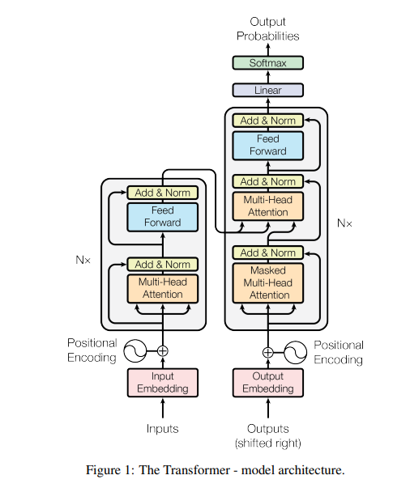

# Attention is all your need - Transformer implementation

这个文件夹是基于**《Attention is all your need》**论文复现的完整Transformer架构代码，包括：

1. 输入部分：Embedding + 位置编码
2. 编码器：**注意力机制**
3. 解码器
4. 输出部分：linear + softmax

最后还会将各部分结合起来构建一个完整的transformer模型。

#### 代码使用了很详细的注释，可以帮助你：

1. 对论文更好地理解：先看论文，再看代码。

   推荐视频：《Transformer论文逐段精读【论文精读】- 李沐》

   https://www.bilibili.com/video/BV1pu411o7BE/?spm_id_from=333.788.recommend_more_video.0&vd_source=436f932307dc32efd7c219af7265e7c3

   

2. 直接了解代码实现：先看代码，再根据代码匹配论文思路